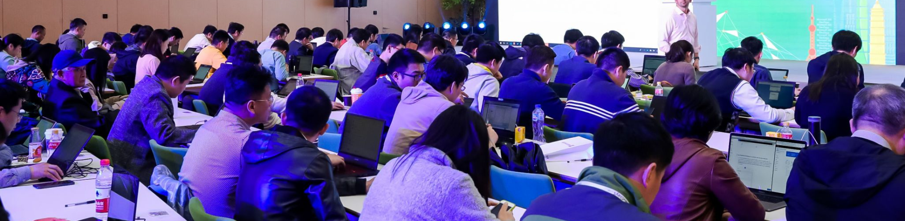

# Save the Date and Register now for Microsoft 365 DevDays!

*Article • 10/18/2018*

## Microsoft 365 DevDays

Microsoft is coming back to Beijing this November for another exciting developer event! This two-day event will be packed with both introductory and deep-dive sessions across the Microsoft 365 and SQL Server platform.

### Attend a range of sessions with highlights such as:

- Custom AI solutions with Azure Databricks
- Microsoft Graph 101 and Roadmap Updates
- Development with SharePoint Framework (SPFx)
- Bot Development with Microsoft Teams

### Event Details:

**What:** Microsoft 365 DevDays  
**When:** November 17th-18th, 2018  
**Where:** Microsoft Asia Pacific R&D Group Headquarters  
**Who:** Solution providers, system integrators, developers, ISVs, startups, and students  
**Cost:** FREE!  

This is an event you won’t want to miss, register now!

<a href="#" style="display: inline-block; padding: 10px 20px; font-size: 16px; color: white; background-color: #0078D4; text-decoration: none; border-radius: 5px;">REGISTER NOW</a>

You can find all event details at [here](#)

Contact us with any questions at [microsoftdevdays@microsoft.com](mailto:microsoftdevdays@microsoft.com).

# May 11, 2023

| Time            | Sessions |
|----------------|----------|
| **9:00-9:20AM**  | Introduction to The Microsoft Interoperability Commitment - *Hagit Galatzer* |
| **9:20-9:45AM**  | Integrate the Power of Office365 through Co-Auth and File Synchronization Protocols 📄 - *Jinlin Xu* |
| **9:45-10:30AM** | Use the Capabilities of Azure Artificial Intelligence with the Open XML SDK to Protect Personally Identifiable Information 📄 🎥 - *Michael Bowen* |
| **10:30-11:00AM** | **Break** |
| **11:00-11:45AM** | File Sharing test suites overview and demo 📄 🎥 - *Obaro Ogbo, Amalachukwu Offiah* |
| **11:45-12:30PM** | SMB3.1.1 POSIX Extensions 📄 - *Steve French* |
| **12:30-1:15PM** | Accessing files remotely from the smallest to the largest devices (and the cloud): SMB3.1.1 improvements to the Linux client 📄 - *Steve French* |

<h4>
    <strong>September 18, 2023</strong>
</h4>

    <i>*agenda subject to change</i>

<figure class="table" style="width:100%;">
    <table class="ck-table-resized" style="background-color:hsl(0, 0%, 100%);border:1px solid hsl(0, 0%, 30%);">
        <colgroup><col style="width:11.61%;"><col style="width:88.39%;"></colgroup>
        <thead>
            <tr>
                <th style="border:1px solid hsl(0, 0%, 60%);height:30px;padding:0px;width:130px;">
                    

                        Time
                    

                </th>
                <th style="background-color:hsl(0, 0%, 30%);border:1px solid hsl(0, 0%, 60%);height:30px;padding:0px;">
                    

                        Sessions
                    

                </th>
            </tr>
        </thead>
        <tbody>
            <tr>
                <td style="border:1px solid hsl(0, 0%, 60%);height:36px;padding:0px;width:130px;">
                    

                        <strong>9:00 AM-10:00 AM</strong>
                    

                </td>
                <td style="border:1px solid hsl(0, 0%, 60%);height:36px;padding:0px;">
                    

                        <strong>Welcome! IO Lab Testing Starts</strong>
                    

                </td>
            </tr>
            <tr>
                <td style="border:1px solid hsl(0, 0%, 60%);height:36px;padding:0px;width:130px;">
                    

                        <strong>11:00 AM-11:45 AM</strong>
                    

                </td>
                <td style="border:1px solid hsl(0, 0%, 60%);height:36px;padding:0px;">
                    

                        <strong>Hands-On Lab Overview </strong>Obaro Ogbo
                    

                </td>
            </tr>
            <tr>
                <td style="border:1px solid hsl(0, 0%, 60%);height:36px;padding:0px;width:130px;">
                    

                        <strong>12:30 PM-1:30 PM</strong>
                    

                </td>
                <td style="background-color:hsl(0, 0%, 30%);border:1px solid hsl(0, 0%, 60%);height:36px;padding:0px;">
                    

                        <strong>SNIA SDC Lunch</strong>
                    

                </td>
            </tr>
            <tr>
                <td style="border:1px solid hsl(0, 0%, 60%);height:36px;padding:0px;width:130px;">
                    

                        <strong>2:00 PM-2:45 PM</strong>
                    

                </td>
                <td style="border:1px solid hsl(0, 0%, 60%);height:36px;padding:0px;">
                    

                        <strong>Wireshark Dissectors for Microsoft Windows Protocols: Our Contributions and Future Plans </strong>Abiodun Aremu
                    

                </td>
            </tr>
            <tr>
                <td style="border:1px solid hsl(0, 0%, 60%);height:36px;padding:0px;width:130px;">
                    

                        <strong>3:00 PM-3:45 PM</strong>
                    

                </td>
                <td style="border:1px solid hsl(0, 0%, 60%);height:36px;padding:0px;">
                    

                        <strong>Test Suite Over Linux &amp; New Test Suites Features </strong>Obaro Ogbo
                    

                </td>
            </tr>
            <tr>
                <td style="border:1px solid hsl(0, 0%, 60%);height:36px;padding:0px;">
                    

                        <strong>4:00 PM-4:45 PM</strong>
                    

                </td>
                <td style="border:1px solid hsl(0, 0%, 60%);height:36px;padding:0px;">
                    

                        <strong>SMB3.1.1 POSIX Extensions </strong>Steve French
                    

                </td>
            </tr>
            <tr>
                <td style="border:1px solid hsl(0, 0%, 60%);height:36px;padding:0px;">
                    

                        <strong>5:30 PM-7:30 PM</strong>
                    

                </td>
                <td style="border:1px solid hsl(0, 0%, 60%);height:36px;padding:0px;">
                    

                        <strong>SMB3 IO Lab Reception</strong>
                    

                </td>
            </tr>
        </tbody>
    </table>
</figure>
